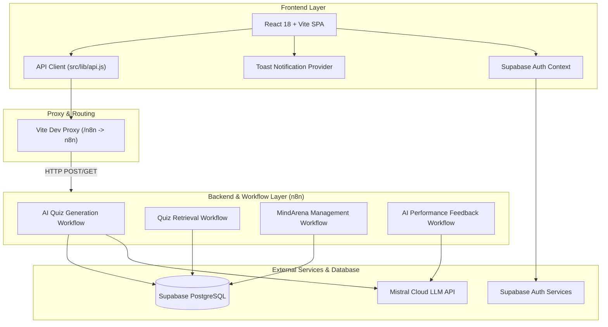

# MindArena — Full-Stack Technical Documentation & Architecture Reference

Welcome to the official technical documentation for **MindArena**, a real-time, AI-powered multiplayer quiz arena platform. MindArena allows users to generate AI-driven quizzes, host competitive multiplayer contests, track live player progress, receive AI performance feedback, and challenge friends in real-time.

---

## 1. Project Overview & Purpose

**MindArena** bridges AI content generation and real-time multiplayer gamification into an engaging learning platform. 

### Key Objectives:
- **Instant AI Quiz Generation**: Dynamically create balanced, multiple-choice quizzes on any topic and difficulty using Mistral AI models.
- **Real-Time Multiplayer Contests**: Host rooms where multiple players join via a unique 6-character room code.
- **Server-Side Scoring**: Calculate scores securely in n8n workflows without exposing answers or explanations on the client side during live contests.
- **Personalized AI Feedback**: Analyze solo and contest performance to generate custom learning suggestions and highlight player strengths.
- **Modern Responsive UX**: Provide a premium dark-themed UI built with React, Vite, and Tailwind CSS.

---

## 2. System Architecture

MindArena uses a decoupled, event-driven micro-service architecture powered by **React (Frontend)**, **Vite (Development & Proxy)**, **n8n (Workflow Backend & Automation)**, **Supabase (PostgreSQL Database & Auth)**, and **Mistral AI (LLM Provider)**.



---

## 3. Database Schema

MindArena uses PostgreSQL hosted on **Supabase**. The database schema consists of 7 core tables:

### 3.1 `profiles`
Stores user identity metadata linked directly to Supabase Auth `auth.uid()`.
```sql
create table public.profiles (
  id uuid not null default auth.uid(),
  created_at timestamp with time zone not null default now(),
  full_name text null,
  email text null,
  constraint profiles_pkey primary key (id)
);
```

### 3.2 `quizzes`
Catalog of generated quiz topics, difficulty settings, and question counts.
```sql
create table public.quizzes (
  id bigint generated always as identity not null,
  topic text not null,
  difficulty text not null,
  number_of_questions integer not null,
  created_at timestamp without time zone null default now(),
  constraint quizzes_pkey primary key (id)
);
```

### 3.3 `questions`
Contains questions, option choices, correct answers, and explanations.
```sql
create table public.questions (
  id bigint generated always as identity not null,
  quiz_id bigint not null references public.quizzes(id) on delete cascade,
  question text not null,
  option_a text not null,
  option_b text not null,
  option_c text not null,
  option_d text not null,
  correct_answer text not null,
  explanation text null,
  constraint questions_pkey primary key (id)
);
```

### 3.4 `rooms`
Manages multiplayer contest rooms and status progression (`waiting` -> `started` -> `completed`).
```sql
create table public.rooms (
  id uuid not null default gen_random_uuid(),
  room_code text not null unique,
  host_id uuid not null references public.profiles(id) on delete cascade,
  quiz_id bigint null references public.quizzes(id) on delete set null,
  topic text not null,
  difficulty text not null,
  number_of_questions integer not null default 5,
  max_players integer not null default 10 check (max_players >= 2 and max_players <= 10),
  status text not null default 'waiting' check (status in ('waiting', 'started', 'completed')),
  created_at timestamp with time zone null default now(),
  constraint rooms_pkey primary key (id)
);
```

### 3.5 `room_players`
Tracks players participating in a specific room.
```sql
create table public.room_players (
  id uuid not null default gen_random_uuid(),
  room_id uuid not null references public.rooms(id) on delete cascade,
  user_id uuid not null references public.profiles(id) on delete cascade,
  player_name text not null,
  is_host boolean not null default false,
  joined_at timestamp with time zone not null default now(),
  constraint room_players_pkey primary key (id),
  constraint room_players_room_id_user_id_key unique (room_id, user_id)
);
```

### 3.6 `contest_results`
Stores final contest submissions, percentage scores, and completion times.
```sql
create table public.contest_results (
  id uuid not null default gen_random_uuid(),
  room_id uuid not null references public.rooms(id) on delete cascade,
  user_id uuid not null references public.profiles(id) on delete cascade,
  player_name text not null,
  score integer not null,
  total_questions integer not null,
  percentage numeric(5, 2) not null,
  completion_time_seconds integer not null,
  submitted_at timestamp with time zone null default now(),
  constraint contest_results_pkey primary key (id),
  constraint contest_results_room_id_user_id_key unique (room_id, user_id)
);
```

### 3.7 `quiz_attempts`
Records solo practice quiz completions for individual tracking.
```sql
create table public.quiz_attempts (
  id uuid not null default gen_random_uuid(),
  user_id uuid not null references public.profiles(id) on delete cascade,
  score integer not null,
  total_questions integer not null,
  completed_at timestamp with time zone null default now(),
  topic text null,
  difficulty text null,
  constraint quiz_attempts_pkey primary key (id)
);
```

---

## 4. n8n Workflows Architecture

MindArena relies on 4 modular n8n workflows serving webhooks to the frontend:

### 4.1 AI Quiz Generation (`/generate-quiz`)
- **Webhook Input**: `{ topic, difficulty, number_of_questions }`
- **Flow**:
  1. Inserts a row into `quizzes`.
  2. Calls Mistral AI LLM Chain to generate structured JSON questions.
  3. Validates and limits questions to the requested count.
  4. Inserts all generated items into `questions` table referencing `quiz_id`.
  5. **Response**: `{ success: true, message: "...", quiz_id: 12 }`

### 4.2 Quiz Retrieval (`/get-quiz`)
- **Webhook Input**: `GET /get-quiz?id=12`
- **Flow**:
  1. Fetches quiz row from `quizzes` table.
  2. Fetches matching rows from `questions` table.
  3. **Response**: `{ quiz: {...}, questions: [...] }` (Includes `correct_answer` for practice mode).

### 4.3 MindArena Management (`/arena-management-test`)
Single endpoint dispatcher handling room lifecycle actions:
- `createRoom`: Creates quiz, inserts `rooms` row, adds host to `room_players`.
- `joinRoom`: Validates room code, checks player limit and duplicate entry, inserts player into `room_players`.
- `getRoom`: Fetches room details and complete list of joined players for lobby polling.
- `startContest`: Verifies host authorization and updates room status to `'started'`.
- `getContest`: Fetches questions **without** `correct_answer` or `explanation` to ensure anti-cheat integrity during live contest.
- `submitResult`: Evaluates submitted answers against actual answers server-side, calculates score/percentage, and upserts into `contest_results`.
- `getLeaderboard`: Retrieves ranked contest results sorted by `percentage DESC, completion_time_seconds ASC`.

### 4.4 AI Performance Feedback (`/ai-feedback`)
- **Webhook Input**: `{ topic, difficulty, score, total_questions, percentage }`
- **Flow**:
  1. Prompts Mistral AI to evaluate player accuracy and time.
  2. Returns structured JSON containing overall performance summary, strengths, areas to improve, and practical study suggestions.

---

## 5. UI/UX Architecture & Enhancements

### 5.1 Reusable Loading Architecture (`LoadingScreen.jsx`)
Because n8n workflows take several seconds to generate AI quizzes or compute scores, MindArena provides a full-screen/card loading overlay component with rotating status messages:
- **Dynamic Status Messages**: Keeps the user informed ("Connecting to Mistral AI...", "Generating balanced questions...", "Saving to database...").
- **Lifecycle Integration**: Connected directly to actual async request lifecycles (starts when button is clicked, disappears when response returns).
- **Duplicate Click Prevention**: All form submit buttons are automatically disabled during pending requests.

### 5.2 Toast Notification System (`ToastContext.jsx`)
Global toast provider accessible via `useToast()` hook across all pages:
- `toast.success(msg)`: Green toast popup (e.g. "Room code copied to clipboard!", "Joined room successfully!").
- `toast.error(msg)`: Red error toast popup with custom error message.
- `toast.info(msg)`: Blue info toast (e.g. "Jane joined the lobby!").
- `toast.warning(msg)`: Amber warning toast popup.

### 5.3 Confirmation Modals (`ConfirmModal.jsx`)
Interactive modal component preventing accidental navigation or data loss when leaving an active contest lobby or live quiz session.

### 5.4 Keyboard Accessibility
- **Quiz Shortcuts**: During live contests (`LiveContest.jsx` and `PracticeQuiz.jsx`), pressing keys <kbd>A</kbd>, <kbd>B</kbd>, <kbd>C</kbd>, or <kbd>D</kbd> instantly selects options A, B, C, or D.

---

## 6. Authentication System

MindArena supports dual authentication modes via Supabase Auth:

1. **Google OAuth**: Single-click social authentication (`loginWithGoogle`).
2. **Email & Password**: 
   - User registration (`signUpWithEmail`)
   - User login (`loginWithEmail`)
   - Password recovery modal (`resetPassword`)
3. **Profile Synchronization**:
   Every successful login automatically synchronizes user data into `public.profiles` so foreign keys across rooms and contest results remain consistent:
   ```javascript
   await supabase.from('profiles').upsert({
     id: authUser.id,
     full_name: fullName,
     email: authUser.email
   }, { onConflict: 'id' });
   ```

---

## 7. Setup & Development Guide

### Prerequisites
- Node.js (v18 or higher)
- n8n instance running locally (`http://localhost:5678`) or hosted
- Supabase Project (PostgreSQL database & Auth enabled)

### Step 1: Clone & Install Dependencies
```bash
cd mindarena
npm install
```

### Step 2: Configure Environment Variables
Create a `.env` file in the root directory:
```env
VITE_SUPABASE_URL=https://your-supabase-project.supabase.co
VITE_SUPABASE_ANON_KEY=your-supabase-anon-key
VITE_N8N_BASE_URL=http://localhost:5678/webhook-test
```

### Step 3: Database Setup
Execute the SQL schemas provided in `schemas/TABLE SCHEMAS.txt` inside your Supabase SQL Editor.

### Step 4: Import n8n Workflows
Import the JSON files from the `workflows/` directory into your n8n instance:
1. `workflows/AI Quiz Generation.json`
2. `workflows/Quiz Retrieval.json`
3. `workflows/MindArena Management.json`
4. `workflows/AI Performance Feedback.json`

Assign your Supabase credentials and Mistral API credentials to the nodes in n8n.

### Step 5: Start Development Server
```bash
npm run dev
```
Open `http://localhost:5173` in your browser.
